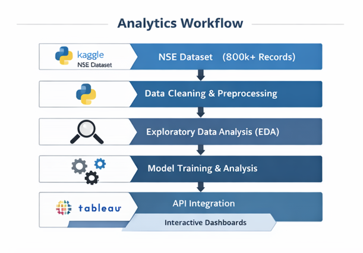
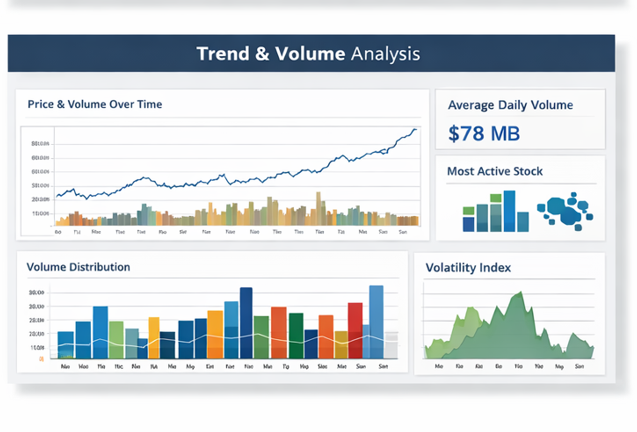

# Stock Data Insights Platform 📈
### End-to-End Data Analytics & Visualization Project

## Overview
The **Stock Data Insights Platform** is a data analytics solution designed to analyze and visualize large-scale stock market data from the **National Stock Exchange (NSE)**. The platform enables investors, traders, and financial analysts to explore trends, monitor market behavior, and derive actionable insights using advanced analytics and interactive dashboards.

This project demonstrates the complete data analytics lifecycle — from data ingestion and preprocessing to exploratory analysis, model training, API integration, and Tableau-based visualization. :contentReference[oaicite:0]{index=0}

---

## Business Problem
Financial market participants face challenges analyzing massive volumes of stock data to identify meaningful trends and investment opportunities. Existing tools often lack flexibility, depth, and intuitive visualization capabilities, making data-driven decision-making difficult in fast-moving markets. :contentReference[oaicite:1]{index=1}

---

## Solution
This platform addresses these challenges by:
- Processing **800,000+ stock market records**
- Performing **data cleaning, EDA, and model training in Python**
- Delivering **interactive dashboards in Tableau**
- Providing insights that support **portfolio optimization and market monitoring**

---

## Architecture & Workflow

1. Data Collection (Kaggle – NSE Stock Dataset)
2. Data Cleaning & Preprocessing (Python)
3. Exploratory Data Analysis (EDA)
4. Model Training & Analysis
5. API Integration
6. Data Visualization using Tableau :contentReference[oaicite:2]{index=2}

---

## Dataset Details
- **Rows:** 800,000+
- **Size:** ~78 MB
- **Columns:** 13
  - SYMBOL, SERIES, OPEN, HIGH, LOW, CLOSE
  - LAST, PREVCLOSE, TOTTRDQTY, TOTTRDVAL
  - TIMESTAMP, TOTALTRADES, ISIN :contentReference[oaicite:3]{index=3}

---

## Tools & Technologies
- **Python** (Pandas, NumPy, Matplotlib)
- **Tableau** (Dashboards & Visual Storytelling)
- **Streamlit** (Interactive Application)
- **VS Code / PyCharm**
- **Kaggle Dataset**
- **REST API Integration** :contentReference[oaicite:4]{index=4}

---

## Key Features
- Cleaned and transformed large-scale financial datasets
- Identified stock trends, volume movements, and price behavior
- Built analytical models to support investment insights
- Designed interactive Tableau dashboards for non-technical users
- Enabled fast decision-making through visual storytelling

---

## Tableau Dashboard Preview

---

## Business Value
- Helps investors identify trends and market opportunities
- Improves portfolio analysis and monitoring
- Converts raw market data into actionable insights
- Supports data-driven financial decision-making :contentReference[oaicite:5]{index=5}

---

## Project Files
- `Business Case.docx` – Business requirements and value proposition
- `Technical Design Document.docx` – System architecture & tech stack
- `Tableau Workbook (.twb)` – Dashboard structure
- `Presentation (.pptx)` – Project walkthrough
- `/images` – Dashboard screenshots

---

## Author
**Akshaykumar Thakare**  
Data Analyst | AI & Big Data  
📍 Canada  
🔗 GitHub: https://github.com/AkshayyThakare
